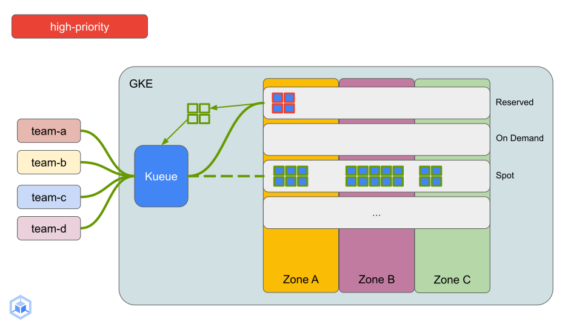
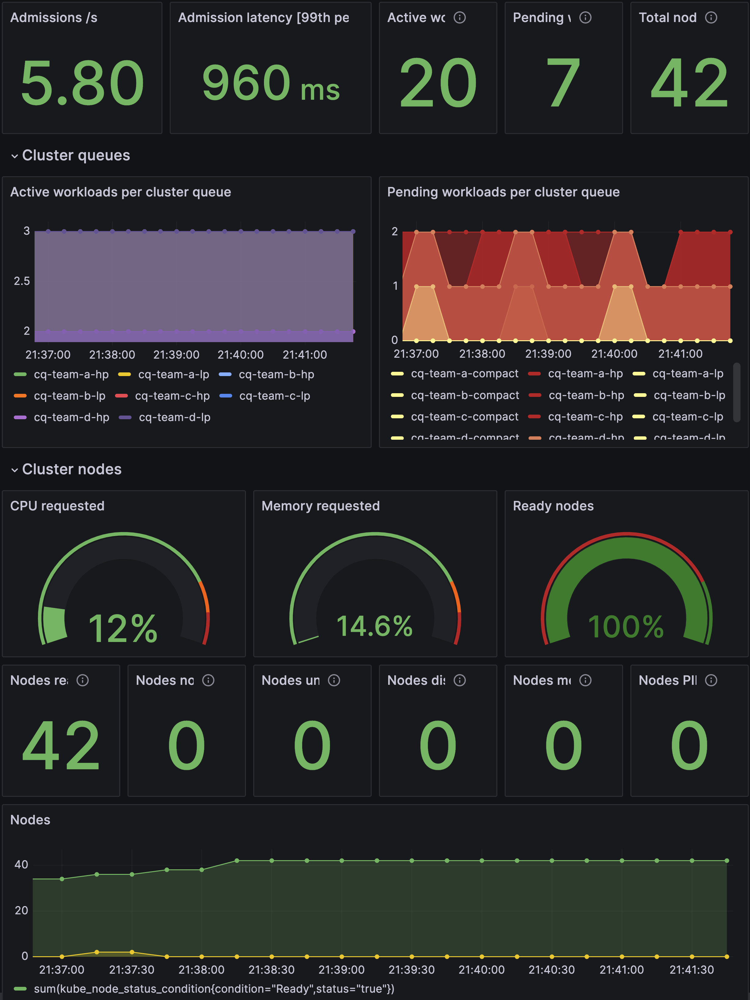

# Reference Architecture: Batch Processing Platform on GKE for Windows

## Purpose

This reference architecture is intended to help platform administrators, cloud architects, and operations professionals deploy a batch processing platform on [Google Kubernetes Engine](https://cloud.google.com/kubernetes-engine/docs/concepts/kubernetes-engine-overview) (GKE) for Windows batch workloads. This document features GKE in [Standard](https://cloud.google.com/kubernetes-engine/docs/concepts/cluster-architecture#nodes) mode, using [Kueue](https://kueue.sigs.k8s.io/) to manage resource quotas and borrowing rules between multiple tenant teams sharing the cluster to run their batch workloads in a fair, cost efficient and performant way. [Best practices for running batch workloads on GKE](https://cloud.google.com/kubernetes-engine/docs/best-practices/batch-platform-on-gke) discusses many recommendations that are implemented in this document.


## Overview

Traditionally, batch platforms have two main user personas, developers and platform administrators:

* A developer submits a Job specifying the program, the data to be processed, and requirements for the Job.

* A platform administrator manages and delivers an efficient and reliable batch processing platform to the developers.

Let's assume we have four teams of developers (`team-a`, `team-b`, `team-c`, `team-d`) who want to share a GKE cluster to run their Windows batch workloads. Additionally, `team-a` and `team-b` share billing so would like to use each other's unused resource quota for their workloads. `team-c` and `team-d` have a similar agreement. The Organization has purchased a [Committed Use Discount consumed via reservations](https://cloud.google.com/compute/docs/instances/reservations-with-commitments) and would like to maximize the utilization of their reservations before bursting into [On-demand](https://cloud.google.com/compute/vm-instance-pricing) or [Spot](https://cloud.google.com/compute/docs/instances/spot) VMs.

To support these teams, the platform administrator would create a GKE cluster and configure it with [Google published good practices](https://cloud.google.com/kubernetes-engine/docs/best-practices/batch-platform-on-gke) for building batch platforms on GKE, in addition to their specific organizational best practices.
 

This reference architecture illustrates an example of a batch platform on GKE that can support multiple teams:


- A regional GKE cluster with [Node Auto Provisioning](https://cloud.google.com/kubernetes-engine/docs/concepts/node-auto-provisioning) enabled, private nodes and [Cloud NAT](https://cloud.google.com/nat/docs/overview) for outbound external access. A Cloud Monitoring dashboard tracking GPU utilization metrics is also created.

  - The cluster is configured with user defined node pools and is capable of creating auto-provisioned GPU node pools based on workload requirements:

    - Reserved node pool consuming zonal VM [reservations](https://cloud.google.com/compute/docs/instances/reservations-overview).
    
    - Autoscaling [On-demand](https://cloud.google.com/compute/vm-instance-pricing) node pool for high-priority Jobs spilling over from reservations.
    
    - Autoscaling [Spot](https://cloud.google.com/compute/docs/instances/spot) node pool for failure tolerant or low-priority workloads spilling over from reservations.

  - Four teams (`team-a`, `team-b`, `team-c`, `team-d`) each with their own [namespace](https://kubernetes.io/docs/concepts/overview/working-with-objects/namespaces/) on the cluster, with [Workload Identity](https://cloud.google.com/kubernetes-engine/docs/concepts/workload-identity) established.

  - [PriorityClasses](https://kubernetes.io/docs/concepts/scheduling-eviction/pod-priority-preemption/) defined for low-priority (default) and high-priority Jobs. Incoming high-priority Jobs can preempt running low-priority Jobs to reclaim reserved resources.

  - Kueue is configured such that:
    - Each team has a `high-priority queue`, a `low-priority` queue and a `compact-placement` queue to which Jobs are submitted.
    
    - Three ResourceFlavors defined; one each for `reserved`, `on-demand` and `spot` VMs.
    
    - [Prometheus and Grafana](https://github.com/prometheus-operator/kube-prometheus) are installed on the cluster for monitoring Kueue.

- This reference architecture shows the teams submitting the following workloads:
    
    - **Low-priority Jobs:** Jobs that don't specify a PriorityClass will get this default PriorityClass set to them. Kueue is configured to allow these Jobs to run on reserved VMs or Spot VMs. If there is no room in or if a low-priority Job gets preempted from the reserved node pool, Kueue will evaluate them for other ResourceFlavors and will assign them the Spot VM ResourceFlavor. In this example, each low-priority Job will have two Pods.

    - **High-priority Jobs:** Jobs specifying this PriorityClass will preempt any low-priority Jobs running on reserved VMs. Any overflow high-priority Jobs will trigger scale-up in the On-demand node pool. In this example, each high-priority Job will have two Pods.
   

## Prerequistes

1. This reference architecture has been tested on [Cloud Shell](https://shell.cloud.google.com) which comes preinstalled with [Google Cloud SDK](https://cloud.google.com/sdk) that is required to complete this guide.

2. Since a recent change in Grafana, services that run behind a reverse proxy cannot directly access metrics data. Port-forwarding from Cloud Shell, you would not be able to view Kueue metrics in Grafana. For a portion of this guide, you will be doing a port-forward from your local machine and for this, your local machine must have [gcloud CLI](https://cloud.google.com/sdk/docs/install) available.

2. It is recommended to start the guide in a fresh project since the easiest way to clean up once complete is to delete the project. See [here](https://cloud.google.com/resource-manager/docs/creating-managing-projects) for more details.


## Deploy Google Cloud resources using Cloud Build and Terraform.

1. Export the required environment variables; replace the value of `YOUR_PROJECT_ID` with that of a fresh project you created for this tutorial, `YOUR_REGION` with the name of your chosen Google Cloud region (eg. us-central1) and `YOUR_ZONE` with one of the zones in your chosen region (eg. us-central1-c).

   ```bash
   export PROJECT_ID=YOUR_PROJECT_ID
   export REGION=YOUR_REGION
   export ZONE=YOUR_ZONE
   ```

2. Clone this repo, switch to the appropriate subdirectory and run the `create-platform.sh` script. The rest of this step enables the required APIs, creates an IAM policy binding for the Cloud Build service account, creates an Artifact Registry to host the Cloud Build container images and submit a Cloud Build job to create the required Google Cloud resources using Terraform. For more details see `create-platform.sh`. Navigate to the [Cloud Build page in the Google Cloud console](https://console.cloud.google.com/cloud-build) to view status of the build, ensure you're in the context of the correct project.

   ```bash
   cd $HOME && \
   git clone https://github.com/alizaidis/ai-on-gke.git && \
   cd ai-on-gke/best-practices/gke-batch-refarch && \
   git checkout gke-batch-windows && \
   ./create-platform.sh
   ```

3. While the build runs, head over to the [Kubernetes Engine page in the console](https://console.cloud.google.com/kubernetes). You can see the cluster being created and configured by the steps running in Cloud Build.

   a. The `Setup GKE` step will create the GKE cluster with a default node pool for system pods, a statically sized reserved node pool with four n2-standard-8 reserved VMs, one auto-scaled (0 - 24 nodes) On-demand node pool for spill-over high-priority Jobs, and one auto-scaled (0 - 36 nodes) Spot node pool for spill-over low-priority Jobs. For more details, or to modify the infrastructure deployed in this document see `01_gke/main.tf` in this repository.

   b. Once the cluster is ready, the next step deploys the system resources for [Kueue](https://github.com/kubernetes-sigs/kueue) and [JobSet](https://github.com/kubernetes-sigs/jobset) are installed.

   c. The `Deploy Manifests: Priority Classes, Teams and Kueue configuration` step establishes default, high and compact PriorityClasses to showcase [preemption](https://kubernetes.io/docs/concepts/scheduling-eviction/pod-priority-preemption/) of lower priority workloads by higher priority workloads for reserved resources. This step deploys four team manifests one for each of `team-a`, `team-b`, `team-c` and `team-d` including Namespaces and Kubernetes Service Accounts to be used for [Workload Identity](https://cloud.google.com/kubernetes-engine/docs/how-to/workload-identity). In addition, this step configures Kueue such that each team gets a high priority queue, a low priority queue and a compact placement queue with the ability to specify nominalQuota and borrowingLimit for the respective flavors. See `02_platform/kueue` for more details.

4. For monitoring Kueue metrics [Prometheus and Grafana](https://github.com/prometheus-operator/kube-prometheus) have been deployed on the GKE cluster and a dashboard to visualize the data has been configured. Since a recent change in Grafana, services that run behind a reverse proxy cannot directly access metrics data. Port-forwarding from Cloud Shell, you would not be able to view Kueue metrics. You will be doing a port-forward from your local machine and for this, your local machine must have [gcloud CLI](https://cloud.google.com/sdk/docs/install) available.

   a. Open a new terminal on your local machine and get the cluster credentials using the following command: 

   ```bash
   gcloud container clusters get-credentials gke-batch-refarch --region $REGION --project $PROJECT_ID
   ```

   b. Next, create a port-forward to the `grafana` service running in the cluster so you can use your web browser to access the Grafana UI. Keep this terminal open for the rest of this guide. 

   ```bash
   kubectl port-forward svc/grafana 8080:3000 -n monitoring
   ```
   
   Expected output:

   ```bash
   Forwarding from 127.0.0.1:8080 -> 3000
   ```

   c. Open a new tab in your web browser and navigate to [`http://localhost:8080`](http://localhost:8080). You should see the Grafana login page. Use `admin` as the username and password.

   d. In the menu located on the top left part of the home page, click `Dashboards`.

   e. Navigate to `Kueue Dashboard`, you should see the current number of nodes in the cluster and other useful Kueue metrics; there should be no workloads pending or admitted. We will return to this dashboard periodically during this guide to see how the system has reacted to incoming workloads.

   
  
5. Deploying Low Priority workloads: Switch to the `03_low_priority` directory and run the `deploy_workloads.sh` script. This script will connect to the cluster and deploy one Job from each team at a time until all teams have four low priority Jobs submitted (job-0 through job-3).

   ```bash
   cd $HOME/ai-on-gke/best-practices/gke-batch-refarch/03_low_priority && \
   ./create_workloads.sh
   ```

   Expected output:

   ```bash
   service/team-a-low-priority-svc-0 created
   configmap/team-a-low-priority-config-0 created
   job.batch/team-a-low-priority-job-0 created
   ...
   service/team-d-low-priority-svc-3 created
   configmap/team-d-low-priority-config-3 created
   job.batch/team-d-low-priority-job-3 created
   ```

   
   
   a. List the Jobs running on the GKE cluster across all namespaces, you should see four Jobs from each team created. These Jobs have been admitted by Kueue.

   ```bash
   watch kubectl get jobs --all-namespaces
   ```

   Expected output:

   ```bash
   NAMESPACE   NAME                        COMPLETIONS   DURATION   AGE
   team-a      team-a-low-priority-job-0   0/2           54s        55s
   team-a      team-a-low-priority-job-1   0/2           49s        49s
   team-a      team-a-low-priority-job-2   0/2           43s        43s
   team-a      team-a-low-priority-job-3   0/2           38s        38s
   team-b      team-b-low-priority-job-0   0/2           53s        53s
   team-b      team-b-low-priority-job-1   0/2           47s        48s
   team-b      team-b-low-priority-job-2   0/2           42s        42s
   team-b      team-b-low-priority-job-3   0/2           37s        37s
   team-c      team-c-low-priority-job-0   0/2           52s        52s
   team-c      team-c-low-priority-job-1   0/2           46s        47s
   team-c      team-c-low-priority-job-2   0/2           41s        41s
   team-c      team-c-low-priority-job-3   0/2           36s        36s
   team-d      team-d-low-priority-job-0   0/2           51s        51s
   team-d      team-d-low-priority-job-1   0/2           45s        46s
   team-d      team-d-low-priority-job-2   0/2           40s        40s
   team-d      team-d-low-priority-job-3   0/2           35s        35s
   ```

   b. In a new terminal tab, watch the ClusterQueues, you should see four admitted workloads for each team's low priority ClusterQueue. These workloads correspond to the Jobs you saw in the previous step.

   ```bash
   watch kubectl get clusterqueues
   ```

   Expected output:

   ```bash
   NAME                COHORT     STRATEGY     PENDING WORKLOADS   ADMITTED WORKLOADS
   cq-team-a-compact   team-a-b   StrictFIFO   0                   0
   cq-team-a-hp        team-a-b   StrictFIFO   0                   0
   cq-team-a-lp        team-a-b   StrictFIFO   0                   4
   cq-team-b-compact   team-a-b   StrictFIFO   0                   0
   cq-team-b-hp        team-a-b   StrictFIFO   0                   0
   cq-team-b-lp        team-a-b   StrictFIFO   0                   4
   cq-team-c-compact   team-c-d   StrictFIFO   0                   0
   cq-team-c-hp        team-c-d   StrictFIFO   0                   0
   cq-team-c-lp        team-c-d   StrictFIFO   0                   4
   cq-team-d-compact   team-c-d   StrictFIFO   0                   0
   cq-team-d-hp        team-c-d   StrictFIFO   0                   0
   cq-team-d-lp        team-c-d   StrictFIFO   0                   4
   ```

   c. Since the Reserved node pool already has nodes available to run admitted low priority workloads, some of these workloads will be scheduled on the Reserved nodes. 

   d. In a new terminal tab, watch the cluster nodes. Initially you should see ten nodes, six in the default node pool and four in the reserved node pool.
   
   ```bash
   watch kubectl get nodes
   ```

   Expected output:

   ```bash
   NAME                                               STATUS   ROLES    AGE   VERSION
   gke-gke-batch-refarch-default-pool-8bba21a2-3328   Ready    <none>   12h   v1.28.3-gke.1203001
   gke-gke-batch-refarch-default-pool-8bba21a2-bmzg   Ready    <none>   12h   v1.28.3-gke.1203001
   gke-gke-batch-refarch-default-pool-9899b2fc-8k19   Ready    <none>   12h   v1.28.3-gke.1203001
   gke-gke-batch-refarch-default-pool-9899b2fc-srxf   Ready    <none>   12h   v1.28.3-gke.1203001
   gke-gke-batch-refarch-default-pool-ab9bedc3-gn5j   Ready    <none>   12h   v1.28.3-gke.1203001
   gke-gke-batch-refarch-default-pool-ab9bedc3-wht3   Ready    <none>   12h   v1.28.3-gke.1203001
   gke-gke-batch-refarch-reserved-np-866c1d22-djvf    Ready    <none>   12h   v1.28.3-gke.1203001
   gke-gke-batch-refarch-reserved-np-866c1d22-p2w7    Ready    <none>   12h   v1.28.3-gke.1203001
   gke-gke-batch-refarch-reserved-np-866c1d22-p42h    Ready    <none>   12h   v1.28.3-gke.1203001
   gke-gke-batch-refarch-reserved-np-866c1d22-r6rt    Ready    <none>   12h   v1.28.3-gke.1203001
   ```

   e. After a short while you should see Spot nodes being added to the Spot node pool to accommodate the low priority Jobs that could not fit on the Reserved node pool (sized for two Jobs at a time).

   Expected output:

   ```bash
   NAME                                               STATUS   ROLES    AGE    VERSION
   gke-gke-batch-refarch-default-pool-8bba21a2-3328   Ready    <none>   12h    v1.28.3-gke.1203001
   gke-gke-batch-refarch-default-pool-8bba21a2-bmzg   Ready    <none>   12h    v1.28.3-gke.1203001
   gke-gke-batch-refarch-default-pool-9899b2fc-8k19   Ready    <none>   12h    v1.28.3-gke.1203001
   gke-gke-batch-refarch-default-pool-9899b2fc-srxf   Ready    <none>   12h    v1.28.3-gke.1203001
   gke-gke-batch-refarch-default-pool-ab9bedc3-gn5j   Ready    <none>   12h    v1.28.3-gke.1203001
   gke-gke-batch-refarch-default-pool-ab9bedc3-wht3   Ready    <none>   12h    v1.28.3-gke.1203001
   gke-gke-batch-refarch-reserved-np-866c1d22-djvf    Ready    <none>   12h    v1.28.3-gke.1203001
   gke-gke-batch-refarch-reserved-np-866c1d22-p2w7    Ready    <none>   12h    v1.28.3-gke.1203001
   gke-gke-batch-refarch-reserved-np-866c1d22-p42h    Ready    <none>   12h    v1.28.3-gke.1203001
   gke-gke-batch-refarch-reserved-np-866c1d22-r6rt    Ready    <none>   12h    v1.28.3-gke.1203001
   gke-gke-batch-refarch-spot-np-fd534d43-2gl8        Ready    <none>   102s   v1.28.3-gke.1203001
   gke-gke-batch-refarch-spot-np-fd534d43-2thb        Ready    <none>   97s    v1.28.3-gke.1203001
   gke-gke-batch-refarch-spot-np-fd534d43-4ccx        Ready    <none>   89s    v1.28.3-gke.1203001
   gke-gke-batch-refarch-spot-np-fd534d43-69p2        Ready    <none>   94s    v1.28.3-gke.1203001
   gke-gke-batch-refarch-spot-np-fd534d43-7246        Ready    <none>   80s    v1.28.3-gke.1203001
   gke-gke-batch-refarch-spot-np-fd534d43-7rhl        Ready    <none>   96s    v1.28.3-gke.1203001
   gke-gke-batch-refarch-spot-np-fd534d43-8267        Ready    <none>   95s    v1.28.3-gke.1203001
   gke-gke-batch-refarch-spot-np-fd534d43-c5x5        Ready    <none>   100s   v1.28.3-gke.1203001
   gke-gke-batch-refarch-spot-np-fd534d43-cc2h        Ready    <none>   109s   v1.28.3-gke.1203001
   gke-gke-batch-refarch-spot-np-fd534d43-fsjs        Ready    <none>   95s    v1.28.3-gke.1203001
   gke-gke-batch-refarch-spot-np-fd534d43-fsqw        Ready    <none>   100s   v1.28.3-gke.1203001
   gke-gke-batch-refarch-spot-np-fd534d43-h9bh        Ready    <none>   96s    v1.28.3-gke.1203001
   gke-gke-batch-refarch-spot-np-fd534d43-hshk        Ready    <none>   69s    v1.28.3-gke.1203001
   gke-gke-batch-refarch-spot-np-fd534d43-htjv        Ready    <none>   97s    v1.28.3-gke.1203001
   gke-gke-batch-refarch-spot-np-fd534d43-j7zc        Ready    <none>   94s    v1.28.3-gke.1203001
   gke-gke-batch-refarch-spot-np-fd534d43-jr45        Ready    <none>   104s   v1.28.3-gke.1203001
   gke-gke-batch-refarch-spot-np-fd534d43-l5v2        Ready    <none>   90s    v1.28.3-gke.1203001
   gke-gke-batch-refarch-spot-np-fd534d43-ltv4        Ready    <none>   98s    v1.28.3-gke.1203001
   gke-gke-batch-refarch-spot-np-fd534d43-ptx9        Ready    <none>   93s    v1.28.3-gke.1203001
   gke-gke-batch-refarch-spot-np-fd534d43-q57t        Ready    <none>   100s   v1.28.3-gke.1203001
   gke-gke-batch-refarch-spot-np-fd534d43-qlsz        Ready    <none>   106s   v1.28.3-gke.1203001
   gke-gke-batch-refarch-spot-np-fd534d43-t5tl        Ready    <none>   100s   v1.28.3-gke.1203001
   gke-gke-batch-refarch-spot-np-fd534d43-t62s        Ready    <none>   105s   v1.28.3-gke.1203001
   gke-gke-batch-refarch-spot-np-fd534d43-wxrr        Ready    <none>   91s    v1.28.3-gke.1203001
   ```

   
   

5. **Deploying High Priority workloads:** Switch to the `04_high_priority` directory and run the `deploy_workloads.sh` script. This script will connect to the cluster and deploy one Job from each team at a time until all teams have four low priority Jobs submitted (job-0 through job-3).

   ```bash
   cd $HOME/ai-on-gke/best-practices/gke-batch-refarch/04_high_priority && \
   ./create_workloads.sh
   ```

   Expected output:

   ```bash
   service/team-a-high-priority-svc-0 created
   configmap/team-a-high-priority-config-0 created
   job.batch/team-a-high-priority-job-0 created
   ...
   service/team-d-high-priority-svc-3 created
   configmap/team-d-high-priority-config-3 created
   job.batch/team-d-high-priority-job-3 created
   ```

   a. Return to the terminal tab watching the `clusterqueues`. You should see high-priority workloads being added to the high-priority clusterqueues.

   ```bash
   watch kubectl get clusterqueues
   ```

   Expected output:

   ```bash
   NAME                COHORT     STRATEGY     PENDING WORKLOADS   ADMITTED WORKLOADS
   cq-team-a-compact   team-a-b   StrictFIFO   0                   0
   cq-team-a-hp        team-a-b   StrictFIFO   2                   2
   cq-team-a-lp        team-a-b   StrictFIFO   1                   3
   cq-team-b-compact   team-a-b   StrictFIFO   0                   0
   cq-team-b-hp        team-a-b   StrictFIFO   2                   2
   cq-team-b-lp        team-a-b   StrictFIFO   0                   3
   cq-team-c-compact   team-c-d   StrictFIFO   0                   0
   cq-team-c-hp        team-c-d   StrictFIFO   2                   2
   cq-team-c-lp        team-c-d   StrictFIFO   0                   3
   cq-team-d-compact   team-c-d   StrictFIFO   0                   0
   cq-team-d-hp        team-c-d   StrictFIFO   2                   2
   cq-team-d-lp        team-c-d   StrictFIFO   0                   3
   ```
   
   b. As high priority workloads are admitted, the low priority workloads running on the Reserved node pool are evicted to make room.
   
   .
   
   These low priority workloads are then set to pending and reevaluated by Kueue. They will use the Spot flavor to schedule on to the Spot node pool once new nodes have spun up to accommodate them.
   
   

   d. Return to the terminal tab watching the cluster nodes, after a short while you should see nodes being added to the On Demand node pool to accommodate the high priority Jobs that could not fit on the Reserved node pool.

   Expected output:

   ```bash
   NAME                                               STATUS   ROLES    AGE     VERSION
   gke-gke-batch-refarch-default-pool-8bba21a2-3328   Ready    <none>   12h     v1.28.3-gke.1203001
   gke-gke-batch-refarch-default-pool-8bba21a2-bmzg   Ready    <none>   12h     v1.28.3-gke.1203001
   gke-gke-batch-refarch-default-pool-9899b2fc-8k19   Ready    <none>   12h     v1.28.3-gke.1203001
   gke-gke-batch-refarch-default-pool-9899b2fc-srxf   Ready    <none>   12h     v1.28.3-gke.1203001
   gke-gke-batch-refarch-default-pool-ab9bedc3-gn5j   Ready    <none>   12h     v1.28.3-gke.1203001
   gke-gke-batch-refarch-default-pool-ab9bedc3-wht3   Ready    <none>   12h     v1.28.3-gke.1203001
   gke-gke-batch-refarch-ondemand-np-48a23fe6-426d    Ready    <none>   3m25s   v1.28.3-gke.1203001
   gke-gke-batch-refarch-ondemand-np-48a23fe6-bs59    Ready    <none>   3m30s   v1.28.3-gke.1203001
   gke-gke-batch-refarch-ondemand-np-48a23fe6-vktd    Ready    <none>   3m24s   v1.28.3-gke.1203001
   gke-gke-batch-refarch-ondemand-np-48a23fe6-znst    Ready    <none>   3m30s   v1.28.3-gke.1203001
   gke-gke-batch-refarch-ondemand-np-8687a394-7dpd    Ready    <none>   2m39s   v1.28.3-gke.1203001
   gke-gke-batch-refarch-ondemand-np-8687a394-ggs4    Ready    <none>   2m41s   v1.28.3-gke.1203001
   gke-gke-batch-refarch-ondemand-np-8687a394-qb49    Ready    <none>   2m32s   v1.28.3-gke.1203001
   gke-gke-batch-refarch-ondemand-np-8687a394-x2cq    Ready    <none>   2m37s   v1.28.3-gke.1203001
   gke-gke-batch-refarch-reserved-np-866c1d22-djvf    Ready    <none>   12h     v1.28.3-gke.1203001
   gke-gke-batch-refarch-reserved-np-866c1d22-p2w7    Ready    <none>   12h     v1.28.3-gke.1203001
   gke-gke-batch-refarch-reserved-np-866c1d22-p42h    Ready    <none>   12h     v1.28.3-gke.1203001
   gke-gke-batch-refarch-reserved-np-866c1d22-r6rt    Ready    <none>   12h     v1.28.3-gke.1203001
   gke-gke-batch-refarch-spot-np-fd534d43-2gl8        Ready    <none>   7m45s   v1.28.3-gke.1203001
   gke-gke-batch-refarch-spot-np-fd534d43-2thb        Ready    <none>   7m40s   v1.28.3-gke.1203001
   gke-gke-batch-refarch-spot-np-fd534d43-4ccx        Ready    <none>   7m32s   v1.28.3-gke.1203001
   gke-gke-batch-refarch-spot-np-fd534d43-69p2        Ready    <none>   7m37s   v1.28.3-gke.1203001
   gke-gke-batch-refarch-spot-np-fd534d43-7246        Ready    <none>   7m23s   v1.28.3-gke.1203001
   gke-gke-batch-refarch-spot-np-fd534d43-7rhl        Ready    <none>   7m39s   v1.28.3-gke.1203001
   gke-gke-batch-refarch-spot-np-fd534d43-8267        Ready    <none>   7m38s   v1.28.3-gke.1203001
   gke-gke-batch-refarch-spot-np-fd534d43-c5x5        Ready    <none>   7m43s   v1.28.3-gke.1203001
   gke-gke-batch-refarch-spot-np-fd534d43-cc2h        Ready    <none>   7m52s   v1.28.3-gke.1203001
   gke-gke-batch-refarch-spot-np-fd534d43-fsjs        Ready    <none>   7m38s   v1.28.3-gke.1203001
   gke-gke-batch-refarch-spot-np-fd534d43-fsqw        Ready    <none>   7m43s   v1.28.3-gke.1203001
   gke-gke-batch-refarch-spot-np-fd534d43-h9bh        Ready    <none>   7m39s   v1.28.3-gke.1203001
   gke-gke-batch-refarch-spot-np-fd534d43-hshk        Ready    <none>   7m12s   v1.28.3-gke.1203001
   gke-gke-batch-refarch-spot-np-fd534d43-htjv        Ready    <none>   7m40s   v1.28.3-gke.1203001
   gke-gke-batch-refarch-spot-np-fd534d43-j7zc        Ready    <none>   7m37s   v1.28.3-gke.1203001
   gke-gke-batch-refarch-spot-np-fd534d43-jr45        Ready    <none>   7m47s   v1.28.3-gke.1203001
   gke-gke-batch-refarch-spot-np-fd534d43-l5v2        Ready    <none>   7m33s   v1.28.3-gke.1203001
   gke-gke-batch-refarch-spot-np-fd534d43-ltv4        Ready    <none>   7m41s   v1.28.3-gke.1203001
   gke-gke-batch-refarch-spot-np-fd534d43-ptx9        Ready    <none>   7m36s   v1.28.3-gke.1203001
   gke-gke-batch-refarch-spot-np-fd534d43-q57t        Ready    <none>   7m43s   v1.28.3-gke.1203001
   gke-gke-batch-refarch-spot-np-fd534d43-qlsz        Ready    <none>   7m49s   v1.28.3-gke.1203001
   gke-gke-batch-refarch-spot-np-fd534d43-t5tl        Ready    <none>   7m43s   v1.28.3-gke.1203001
   gke-gke-batch-refarch-spot-np-fd534d43-t62s        Ready    <none>   7m48s   v1.28.3-gke.1203001
   gke-gke-batch-refarch-spot-np-fd534d43-wxrr        Ready    <none>   7m34s   v1.28.3-gke.1203001
   ```

   The following diagram illustrates scale up in the On Demand node pool:
   
   

   The Kueue dashboard also shows updated node counts, pending and active workloads,and other useful metrics from the batch platform.

   


## Clean up

1. The easiest way to prevent continued billing for the resources that you created for this tutorial is to delete the project you created for the tutorial. Run the following commands from Cloud Shell:

   ```bash
    gcloud config unset project && \
    echo y | gcloud projects delete $PROJECT_ID
   ```

2. If the project needs to be left intact, another option is to destroy the infrastructure created for this tutorial using Cloud Build. Note, this does not destroy the Cloud Storage bucket containing the Terraform state, the artifact registry used to host container images or the IAM bindings and service enablement created via the `create-platform.sh` script.

   ```bash
    cd $HOME/ai-on-gke/best-practices/gke-batch-refarch && \
    ./destroy-platform.sh
   ```
